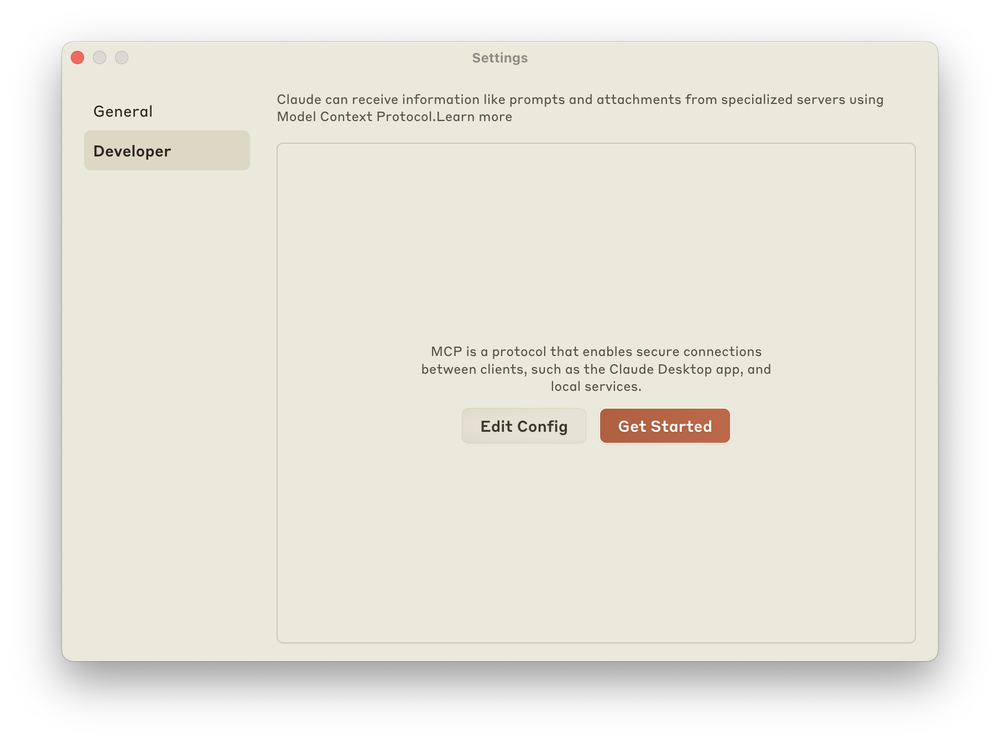
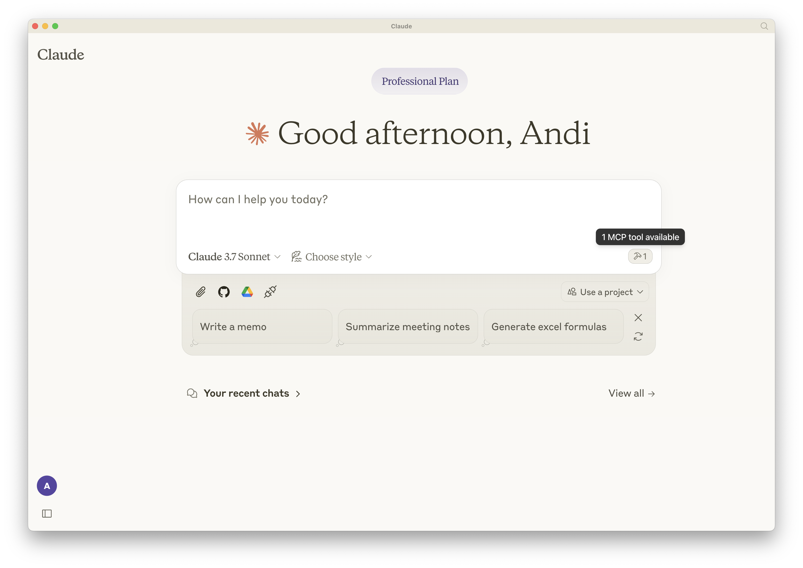
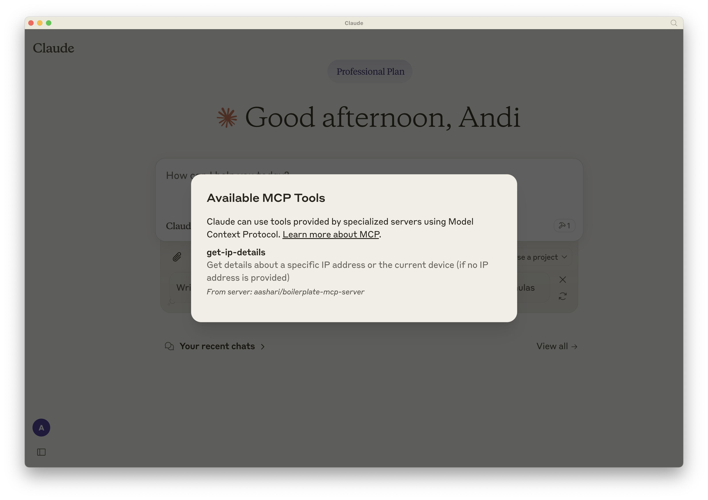
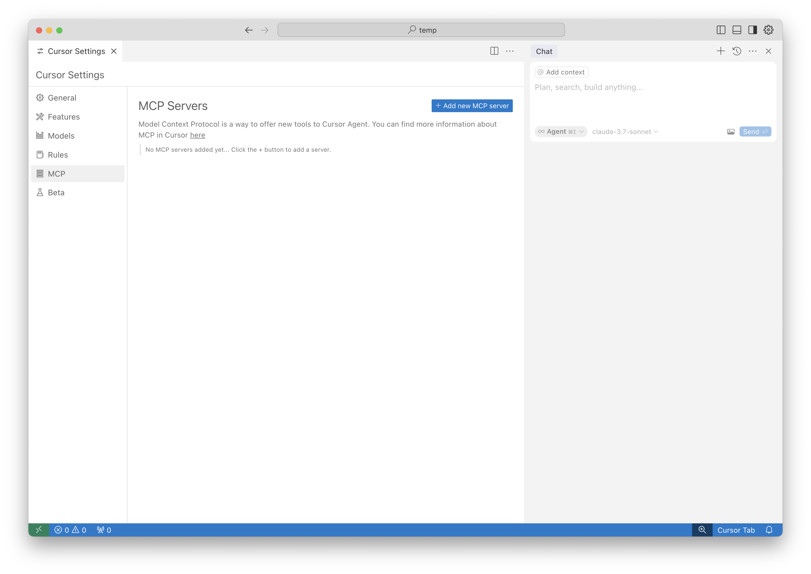
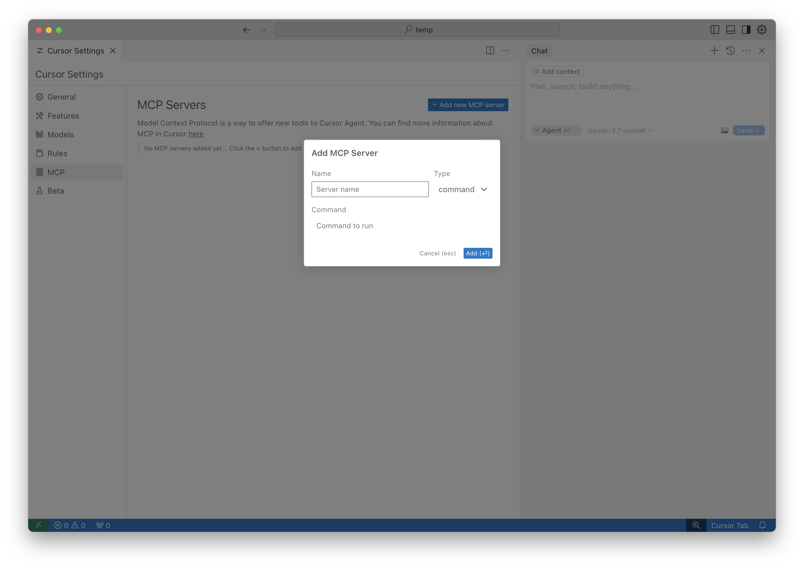
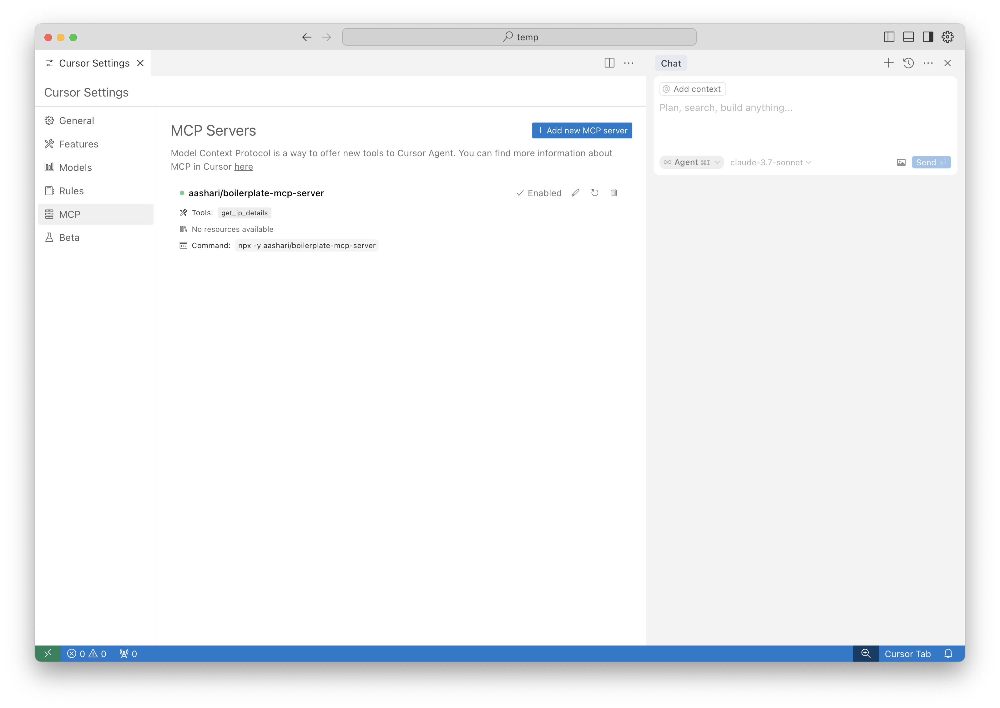

# MCP Atlassian Confluence Server

A Model Context Protocol (MCP) server for Atlassian Confluence integration. This project allows AI assistants like Claude Desktop and Cursor AI to access and interact with Atlassian Confluence content through the Model Context Protocol.

> **Note**: This project is forked from [boilerplate-mcp-server](https://github.com/aashari/boilerplate-mcp-server), a template for building MCP servers. It maintains compatibility with the boilerplate while adding Confluence-specific functionality.

## About MCP

For detailed information about the Model Context Protocol (MCP), including core concepts, architecture, and implementation guides, please refer to the [official MCP documentation](https://modelcontextprotocol.io/docs/).

## Fork Relationship

This project extends the boilerplate-mcp-server with Atlassian Confluence integration capabilities:

- **Base Functionality**: Preserves the IP address lookup functionality from the boilerplate as a reference implementation.
- **Added Features**: Adds Confluence API integration via the `fetchAtlassian` utility in `src/utils/transport.util.ts`.
- **Upstream Updates**: Maintains a remote connection to the boilerplate repository, allowing future improvements to be merged:
  ```bash
  # To pull in updates from the boilerplate
  git fetch boilerplate
  git merge boilerplate/main
  ```

When run without arguments, the package starts the MCP Server for AI clients:
```bash
npx -y aashari/mcp-atlassian-confluence
```

This will start the MCP server in STDIO mode, ready to communicate with AI clients like Claude Desktop.

## Setting Up with Claude Desktop

To use this MCP server with Claude Desktop:

1. **Open Claude Desktop Settings**:
   - Launch Claude Desktop
   - Click on the settings icon (gear) in the top-right corner
   
   

2. **Edit MCP Configuration**:
   - Click on "Edit Config" button
   - This will open File Explorer/Finder with the `claude_desktop_config.json` file

3. **Update Configuration File**:
   - Add the following configuration to the file:
   ```json
   {
     "mcpServers": {
       "aashari/mcp-atlassian-confluence": {
         "command": "npx",
         "args": ["-y", "aashari/mcp-atlassian-confluence"]
       }
     }
   }
   ```
   - Save the file

   To pass configuration options to the server, you can modify the args array:
   ```json
   {
     "mcpServers": {
       "aashari/mcp-atlassian-confluence": {
         "command": "npx",
         "args": ["-y", "DEBUG=true", "CONFLUENCE_BASE_URL=your_url", "CONFLUENCE_USERNAME=your_username", "CONFLUENCE_API_TOKEN=your_token", "aashari/mcp-atlassian-confluence"]
       }
     }
   }
   ```

4. **Restart Claude Desktop**:
   - Close and reopen Claude Desktop to apply the changes
   
   

5. **Verify Tool Availability**:
   - On the Claude home page, look for the hammer icon on the right side
   - Click it to see available tools
   - Ensure the tools are listed
   
   

6. **Test the Tool**:
   - Try asking Claude to use one of the available tools
   - Claude will use the MCP tool to fetch and display the requested information

## Setting Up with Cursor AI

To use this MCP server with Cursor AI:

1. **Open Cursor Settings**:
   - Launch Cursor
   - Press `CMD + SHIFT + P` (or `CTRL + SHIFT + P` on Windows)
   - Type "settings" and select "Cursor Settings"
   - On the sidebar, select "MCP"
   
   

2. **Add New MCP Server**:
   - Click "+ Add new MCP server"
   - A configuration form will appear
   
   

3. **Configure MCP Server**:
   - **Name**: Enter `aashari/mcp-atlassian-confluence`
   - **Type**: Select `command` from the dropdown
   - **Command**: Enter `npx -y aashari/mcp-atlassian-confluence`
   
   To pass configuration options, you can modify the command:
   ```
   DEBUG=true CONFLUENCE_BASE_URL=your_url CONFLUENCE_USERNAME=your_username CONFLUENCE_API_TOKEN=your_token npx -y aashari/mcp-atlassian-confluence
   ```
   
   - Click "Add"

4. **Verify Server Configuration**:
   - The server should now be listed with a green indicator
   - You should see the available tools listed under the server
   
   

5. **Test the Tool**:
   - In the chat sidebar, ensure Agent mode is active
   - Try asking Cursor AI to use one of the available tools
   - Cursor AI will use the MCP tool to fetch and display the requested information

## Project Structure

This project follows a clean architecture pattern with clear separation of concerns:

- **`src/index.ts`**: Main entry point, initializes the MCP server or CLI based on arguments.
- **`src/controllers/`**: Business logic for operations.
- **`src/services/`**: External API integration.
- **`src/tools/`**: MCP tool definitions with Zod schemas.
- **`src/resources/`**: MCP resource definitions.
- **`src/cli/`**: CLI command definitions.
- **`src/utils/`**: Shared utilities, including `transport.util.ts` for Confluence API integration.
- **`dist/`**: Compiled output (generated by `tsup`).

## Prerequisites

- **Node.js**: v22.14.0 or higher (specified in `.node-version` and `package.json`).
- **npm**: Comes with Node.js, used for package management.
- **Atlassian Confluence Access**: You'll need access to a Confluence instance and appropriate API credentials.

## Installation

Install dependencies locally:

```bash
npm install
```

This sets up the project with `@modelcontextprotocol/sdk` and development tools like `tsup`, `jest`, and `eslint`.

## Running Locally

Run the compiled JavaScript code:

```bash
npm start
```

This executes `node dist/index.cjs`, starting the MCP server with `stdio` transport.

## Configuration

The server supports multiple configuration methods with the following priority order (highest to lowest):

1. **Direct Environment Variables**: Set environment variables directly when running the command.
   ```bash
   DEBUG=true CONFLUENCE_BASE_URL=your_url CONFLUENCE_USERNAME=your_username CONFLUENCE_API_TOKEN=your_token npx -y aashari/mcp-atlassian-confluence
   ```

2. **.env File**: Create a `.env` file in the project root directory.
   ```
   DEBUG=true
   CONFLUENCE_BASE_URL=your_url
   CONFLUENCE_USERNAME=your_username
   CONFLUENCE_API_TOKEN=your_token
   ```

3. **Global Configuration File**: Create a global configuration file at `$HOME/.mcp/configs.json`.
   ```json
   {
     "@aashari/mcp-atlassian-confluence": {
       "environments": {
         "DEBUG": "true",
         "CONFLUENCE_BASE_URL": "your_url",
         "CONFLUENCE_USERNAME": "your_username",
         "CONFLUENCE_API_TOKEN": "your_token"
       }
     }
   }
   ```

### Available Configuration Options

- **DEBUG**: Set to `true` to enable debug logging.
- **CONFLUENCE_BASE_URL**: Base URL of your Confluence instance.
- **CONFLUENCE_USERNAME**: Username for Confluence API access.
- **CONFLUENCE_API_TOKEN**: API token for Confluence API access.
- **IPAPI_API_TOKEN**: API token for the IP API service (if required).

### Configuration Priority

The configuration system follows a cascading priority where values from higher priority sources override lower priority ones. This allows you to:
- Use global configuration for shared settings across projects
- Override global settings with project-specific settings in `.env`
- Override both with command-line environment variables for temporary changes

## Development

### Building and Running

```bash
# Build the project
npm run build

# Run the MCP server
npm start

# Run a CLI command
npm start -- get-ip-details 8.8.8.8
```

### Extending with Confluence Features

The project is designed to be extended with Confluence-specific functionality:

1. Use the `fetchAtlassian` utility in `src/utils/transport.util.ts` for API calls
2. Create new tools in `src/tools/` for Confluence operations
3. Add resources in `src/resources/` for Confluence content
4. Implement CLI commands in `src/cli/` for human interaction

## License

[ISC](https://opensource.org/licenses/ISC)
